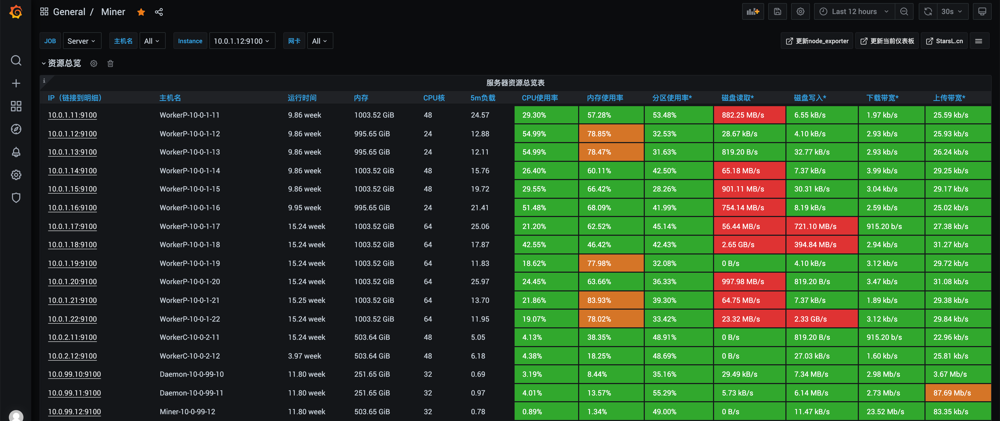
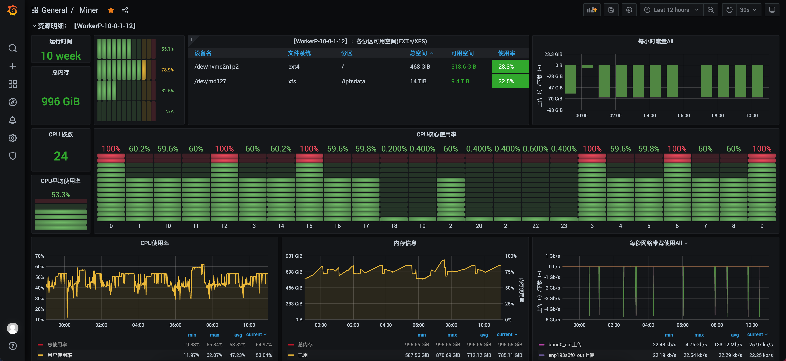

# Lotus-ops
Lotus-ops是FilGuard团队根据自身Lotus的运维实践，针对Lotus挖矿软件的部署运维，整理并开源的一套Ansible Playbook脚本和Shell脚本。另外还提供了完善的Filecoin运维操作手册，供广大Filecoin运维人员参考。

## 功能介绍
- 无缝支持FilGuard团队的Lotus优化软件；
- 提供Ansible Playbook一键部署脚本，批量一键部署Daemon、Miner、Worker；
- 提供常用的Shell脚本，用于初始化Lotus的基础运行环境，如安装基础依赖、SSD组Raid0、安装网卡驱动、Worker检查等等；
- 提供Prometheus + Grafana + Node-exporter监控工具部署脚本，可快速搭建Filecoin集群监控平台；
- 提供Lotus常用命令的快捷操作，提升运维效率。

## 如何使用
请参照[Lotus-ops部署运维工具使用说明](https://github.com/minerdao/posts/blob/master/posts/filecoin/ansible-deploy-tool-usage.md)。

## 加入社群
我们的技术社群为矿工和开发者提供技术交流、资源合作、新项目研究等，欢迎大家加入讨论。
- [Telegram交流群](https://t.me/joinchat/TOGYnsZ2itA0NGZl)
- [Discord交流群](https://discord.gg/4f3DjmDk7j)

## Filecoin运维操作手册
我们整理了Filecoin相关运维和操作手册，包括：
- [Filecoin封装流程详解](https://github.com/minerdao/posts/blob/master/posts/filecoin/lotus-mining-process.md)
- [Filecoin最新挖矿硬件推荐配置](https://github.com/minerdao/posts/blob/master/posts/filecoin/hardware-configuration.md)
- [扇区生命周期详解，扇区状态管理](https://github.com/minerdao/posts/blob/master/posts/filecoin/sector-life-cycle.md)
- [Filecoin节点搭建及启动](https://github.com/minerdao/posts/blob/master/posts/filecoin/daemon-deployment.md)
- [节点管理，节点常用操作，节点同步常见问题](https://github.com/minerdao/posts/blob/master/posts/filecoin/daemon-operation.md)
- [钱包管理及使用场景](https://github.com/minerdao/posts/blob/master/posts/filecoin/wallet-management.md)
- [Lotus-ops部署运维工具使用说明](https://github.com/minerdao/posts/blob/master/posts/filecoin/ansible-deploy-tool-usage.md)
- [Filecoin同构集群搭建流程](https://github.com/minerdao/posts/blob/master/posts/filecoin/mining-cluster-deployment.md)
- [Filecoin存储管理，存储i/o性能分析，网络分析](https://github.com/minerdao/posts/blob/master/posts/filecoin/storage-manage.md)
- [新矿工节点上线CheckList](https://github.com/minerdao/posts/blob/master/posts/filecoin/new-miner-checklist.md)
- [Filecoin监控报警系统搭建](https://github.com/minerdao/posts/blob/master/posts/filecoin/monitoring-deployment.md)
- [Filecoin 订单配置](https://github.com/minerdao/posts/blob/master/posts/filecoin/deals-configuration.md)
- [分布式Miner模块配置和使用](https://github.com/minerdao/posts/blob/master/posts/filecoin/distributed-miner-configuration.md)
- [如何避免掉算力](https://github.com/minerdao/posts/blob/master/posts/filecoin/miner-keep.md)
- [Lotus日常运维CheckList](https://github.com/minerdao/posts/blob/master/posts/filecoin/lotus-ops-checklist.md)
- [常用环境变量说明](https://github.com/minerdao/posts/blob/master/posts/filecoin/environment-usage.md)
- [自动Pledge脚本使用说明](https://github.com/minerdao/posts/blob/master/posts/filecoin/auto-pledge.md)
- 常见运维问题定位与解决
  - [顽固扇区如何删除？](https://github.com/minerdao/posts/blob/master/posts/questions.md#1-顽固扇区如何删除)