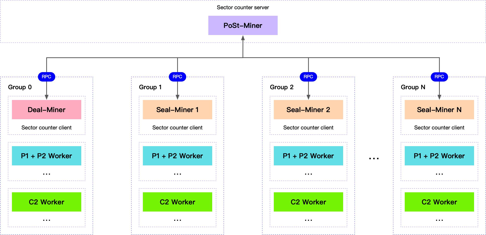
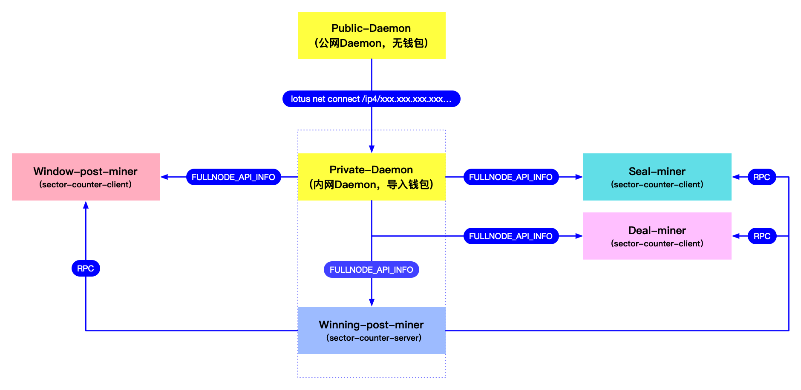

# 分布式Miner模块配置和使用

分布式Miner支持Deal-miner、Seal-miner、Winning-PoSt-miner、Window-PoSt-miner功能分离，各司其职，实现多Miner的分布式部署。

## 1. 解决了哪些问题？
- 单Miner节点负载过高，机器不稳定容易导致时空证明失败掉算力的问题；
- 解决Miner节点负载过高，出块时由于计算不够快，导致的出块失败问题；
- 解决Window-PoSt和Winning-PoSt同时进行时，显卡锁定冲突的问题；
- 解决接单的时候，由于内存占用过高导致Miner异常崩溃，掉算力、出块失败的问题；

## 2. 各Miner功能说明
- 支持同一个MinerId在多台机器上分布式部署；
- 支持Window-post-miner、Winning-post-miner、Deal-miner、Seal-miner功能分离：
  - PoSt-miner：负责Window-PoSt和Winning-PoSt，可分开为两台机器，也可由一台机器完成；
    - Window-post-miner：负责扇区窗口证明时的扇区抽查及提交；
    - Winning-post-miner：负责出块时扇区的随机抽查；
  - Deal-miner：负责接单和检索，和订单扇区密封的任务分配；
  - Seal-miner：负责普通扇区密封的任务分配。



## 3. 实现思路
### 3.1 解决SectorID不重复

利用一台Miner集中分配SectorID，由任意一台Miner的`--sctype=alloce`参数实现。
并由启用`--sclisten=IP:PORT`参数的Miner作为分配SectorID的Server，其他Miner设置`--sctype=get`作为Client，从Server Miner上申请SectorID。

```sh
lotus-miner run --sctype=alloce --sclisten=192.168.1.50:1357
```

### 3.2 解决时空证明由单独的机器完成

由任意一台Miner的`--window-post=true`和`--winning-post=true`参数实现时空证明由一台/两台独立的机器完成，其他Miner要设置`--window-post=false`和`--winning-post=false`。

```sh
lotus-miner run --window-post=true --winning-post=true
```

### 3.3. 解决接单及检索

由任意一台Miner的`--p2p=true`参数实现，接单的Miner需要配置多地址。

```sh
lotus-miner run --p2p=true
```

## 4. 参数说明
- `--window-post` [boolean] 是否允许window-PoSt证明，默认`true`；
- `--winning-post` [boolean] 是否允许winning-PoSt证明，即出块，默认`true`；
- `--p2p` [boolean] 是否允许接单，默认`true`；
- `--sctype` [alloce | get] 扇区分配服务类型，`alloce`表示分配SectorID，`get`表示获取SectorID;
- `--sclisten` [string] 扇区分配服务端监听的地址和端口;

## 5. 配置举例
现有的单Miner集群要切换到分布式Miner，需要先停掉原有Miner和所有Worker，保证没有进行中的任务。然后将原有单Miner的`$LOTUS_STORAGE_PATH`目录，复制到其他Miner上，并将`$LOTUS_STORAGE_PATH/config.toml`文件中[API]部分的`ListenAddress`和`RemoteListenAddress`IP改为当前所在Miner的内网IP。

比如有3个Miner，由PoSt-miner负责SectorID分配(也可由其他Miner分配)。

### 5.1 PoSt-miner
```
lotus-miner run --window-post=true --winning-post=true --p2p=false --sctype=alloce --sclisten=192.168.1.50:1357
```
其中`192.168.1.50`为PoSt-miner的内网IP，`1357`为扇区分配服务的监听端口。
PoSt-miner启动后，在日志中将会有`This miner will be disable p2p`的提示。

如果PoSt-miner为两台机器，则需要分别配置`--window-post`和`--winning-post`参数：

**Window-post-miner**（负责窗口抽查证明）配置为：
```sh
lotus-miner run --window-post=true --winning-post=false --p2p=false --sctype=alloce --sclisten=192.168.1.50:1357
```

**Winning-post-miner**（负责出块的证明）配置为：
```sh
lotus-miner run --window-post=false --winning-post=true --p2p=false --sctype=alloce --sclisten=192.168.1.50:1357
```

**注意：负责扇区分配的Miner，首次部署的时候，需要修改`$LOTUS_STORAGE_PATH/sectorid`文件(首次部署需要创建该文件)，将其中的数字改为大于当前所有扇区ID的一个数字。**

### 5.2 Deal-miner
```
lotus-miner run --window-post=false --winning-post=false --p2p=true --sctype=get --sclisten=192.16810.50:1357
```
其中`--sclisten`监听的地址和端口为做扇区分配Server Miner的IP和端口。  
Deal-miner需要配置外网端口转发和`lotus-miner actor set-addrs`配置多地址。

**注意：Deal-miner也只能配置一台，不然订单检索的时候会路由失败。**

### 5.3 Seal-miner
```
lotus-miner run --window-post=false --winning-post=false --p2p=true --sctype=get --sclisten=192.16810.50:1357
```

### 5.4 需要注意的几个问题
- Seal-miner和Deal-miner的配置参数相同，原理上都是密封扇区的Miner；  
- Seal-miner和Deal-miner启动后，日志中将会输出`This miner will be disable minning block`和`This miner will be disable windowPoSt`；  
- Seal-miner可根据自己的集群规模，配置多台；

## 6. Worker配置
使用分布式Miner以后，需要根据配置的Seal-miner和Deal-miner数量，将Seal-worker分为多个组，和Miner一一对应。

假设现在有1台Deal-miner，2台Seal-miner，5台Seal-worker，因为Deal-miner的接单速度比较慢，可以给Deal-miner分配少量的Seal-worker，其他的Seal-worker全部分配给Seal-miner。

## 7. 常见问题

### 7.1 分布式Miner和Daemon之间如何连接？

分布式miner和daemon之间的连接架构如下图（可点击查看大图）：



- **Daemon-public**：需要配置公网IP，给Daemon-public配公网IP主要是为了提升节点的稳定性和评分，只有节点健康稳定，爆块才会稳定。但是如果直接把导入了钱包的Daemon暴露在公网中也是非常不安全的，毕竟Lotus的钱包管理还是非常原始的。Daemon-public的作用就是连接更多的外部节点。然后让Daemon-private也连接到Daemon-public，因为是内网，连接会非常快。Daemon-public是内网的Miner和外部区块链通信的一个桥梁。
[如何给Daemon配置公网IP?](https://github.com/filguard/lotus-ops/blob/master/documents/daemon-operation.md#4-%E7%BB%99deamon%E9%85%8D%E7%BD%AE%E5%85%AC%E7%BD%91ip)

- **Daemon-private**：内网的Miner全部连接Daemon-private，同时这个Daemon也启动在Winning-post-miner上，保证出块的Miner连接是最快的，考虑冗余的话，可以在Window-post-miner上再同步一个轻节点Daemon作为备份，关于轻节点Daemon，请[参照快照导出导入和快照剪裁](https://github.com/filguard/lotus-ops/blob/master/documents/daemon-operation.md#3-%E5%AF%BC%E5%85%A5%E5%AF%BC%E5%87%BA%E5%90%8C%E6%AD%A5%E6%95%B0%E6%8D%AE%E8%A3%81%E5%89%AA%E5%BF%AB%E7%85%A7)。

- **Winning-post-miner**：只负责出块，因为这台机器负载比较低，所以在上面同时启动Daemon-private。另外，Winning-post-miner也是sector-counter的服务端，负责统一分配扇区ID，其他Miner（主要是Seal-miner和Deal-miner）都从这台机器上申请扇区ID。

- **Window-post-miner**：只负责时空证明，上面可以同时同步一个备份的轻节点Daemon。

- **Seal-miner**：负责分配任务，管理所有的Seal-worker，连接Daemon-private。

- **Deal-miner**：负责接单，连接Daemon-private，需要配置`multiaddress`，需要连接几台Seal-worker，和上面Seal-miner连接的Worker不同，相当于是把所有的Seal-worker分成了2组，Seal-miner连接一组，Deal-miner连接一组。要根据订单的数量，来分配对应数量的Seal-worker，按照我们的经验，1 ~ 2 台Seal-worker就能满足订单密封的需要。

### 7.2 分布式Miner如何切换回单Miner？
初始化一个不含任何元数据(扇区数据)的Winning-post-miner和Window-post-miner，专门用来做时空证明和爆块。切换回单Miner的时候，只需要停掉Winning-post-miner和Window-post-miner，然后在Seal-miner上开启`window-post`和`winning-post`功能即可，也就是以Seal-miner作为回退后的单Miner（因为Seal-miner上的数据是完整的，包含所有扇区数据，Winning-post-miner和Window-post-miner上没有扇区数据）。

### 7.3 关于多个Seal-miner，或者Seal-miner + Deal-miner的说明
建议订单少的话，就不需要Deal-miner了，直接用Seal-miner替代Deal-miner即可。

因为如果配置了多个Seal-miner，或者Seal-miner + Deal-miner以后，如果想回退到单miner，就会有个副作用：Seal-miner只会包含自己的封装的扇区数据，无法同步Deal-miner或其他Seal-miner上的扇区数据，这样通过`lotus-miner sectors list`查看的扇区列表，就是不完整的，`lotus-miner info`的扇区统计数据也是不完整的，只是显示不完整，但是不会影响时空证明和出块。

如果以后有回退到单miner的需求，或者比较介意这个问题，那就只能配一个Seal-miner。按照我们的设计，集群越来越大以后，是不会再有回退到单miner的需求的，所以没有解决多个Seal-miner之间扇区数据一致性的问题（分布式架构里面，也没这个必要）。

### 7.4 分布式Miner架构，Miner之间如何交互？
Miner之间的交互就是从同一个地方获取扇区id的问题，通过rpc交互，其他不需要交互，各司其职即可。所有的Seal-worker只连Seal-miner。

Window-post-miner和Winning-post-miner不需要有Worker，只需要连接Daemon和区块链交互即可，如：
- 查看时空时空证明：`lotus-miner proving deadlines`；
- 查看Miner信息：`lotus-miner info`。

但是Window-post-miner和Winning-post-miner无法看到扇区列表（PoSt-miner本地元数据不含扇区数据）。日常的操作主要在Seal-miner上进行即可，PoSt-miner几乎不用管。