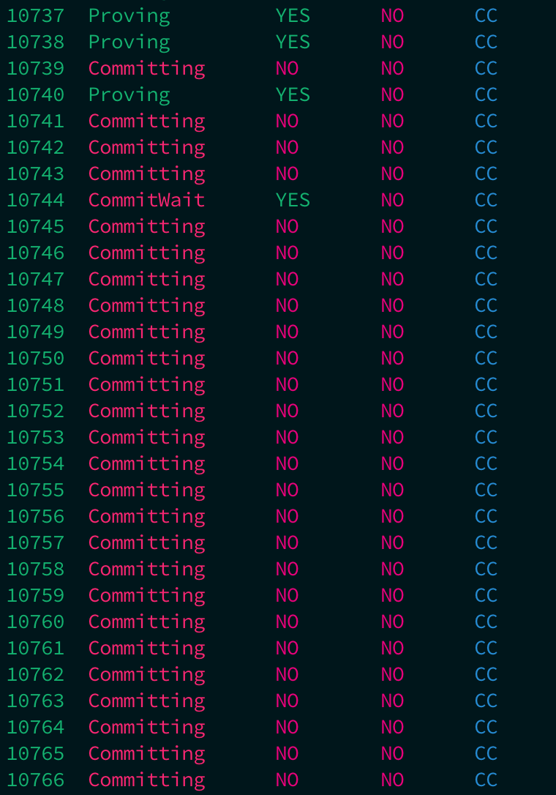
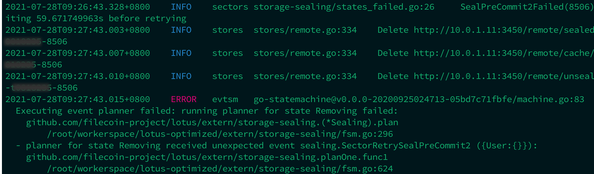

# 常见运维问题定位与解决

## 1 顽固扇区如何删除？
#### 1.1 什么是顽固扇区？
所谓顽固扇区，是指因Worker掉线、扇区超时等原因导致的，无法被成功调度并完成封装的扇区。

顽固扇区并**不是**指`SealPreCommit1Failed`，`PreCommitFailed`，`CommitFailed`这几种状态的扇区，因为这几种状态的扇区，均可通过`lotus-miner sectors remove --really-do-it <SectorId>`命令直接删除掉。

而顽固扇区是指`PreCommit1`，`PreCommit2`，`Committing`，`FinalizeSector`这几种正常状态的扇区，但缺无法成功被调度并完成封装的扇区，执行以下两个命令也无法删除掉。
```sh
lotus-miner sectors update-state --really-do-it <sectorId> Removing
lotus-miner sectors remove --really-do-it <SectorId>
```

#### 1.2 顽固扇区有什么影响？如何发现它？
顽固扇区会停留在扇区列表中，一直不断被调度（但又无法调度成功，扇区日志中通常有大量重复的`retry`操作），不仅浪费了调度系统的队列资源，还会影响扇区封装任务下发的数量。你会发现，扇区明明在列表中，就是无法封装成功，想删还删不掉，非常的痛苦。

如何发现顽固扇区呢？因为Lotus的扇区号都是自增的，只要执行`lotus-miner sectors list --fast`查看一下扇区列表，列表的最后面，都是正在封装的扇区，而且这些扇区ID都是连续的。正常情况下，前面封装完的扇区都是`Proving`状态，如果看到前面`Proving`状态的扇区中夹杂了`PreCommit1`，`PreCommit2`，`Committing`这些状态的扇区，那这些就是顽固扇区了。



另外，也可以通过`lotus-miner sealing jobs | sort -k2`查看正在封装的任务列表，如果发现列表头部的扇区ID和后面的差距很大，如果差了几十个甚至更多，那这些扇区也就是顽固扇区了，或者是扇区封装已经进入死循环了，要尽快处理掉。

#### 1.3 顽固扇区如何删除？
顽固扇区已经无法被成功调度，只能采取“非常手段”来处理。
顽固扇区无法被调度，是因为扇区本身的文件已经丢失了，那么可以创建一个空的扇区文件，让扇区“假装”在封装，只要能被调度上，出现在`lotus-miner sealing jobs`中，就好处理了。

##### `PreCommit1`，`PreCommit2`状态的顽固扇区处理
针对`PreCommit1`，`PreCommit2`这两种状态的扇区，按如下的方法来处理：

① 找一个空闲的Worker（没有任何封装任务），在`LOTUS_WORKER_PATH`的`unsealed`和`seald`目录下，分别创建对应扇区ID的空扇区文件，假设顽固扇区的ID为，那分别在`unsealed`和`seald`目录下执行：
```sh
touch s-t0xxxxxx-100
# 其中t0xxxxxx是矿工ID
```

② 重启该Worker，注意观察Worker的日志中，该扇区会不会开始封装，如果没有开始封装，可以再重启一下Miner。

③ 待该扇区开始封装，在`lotus-miner sealing jobs`列表中能看到以后，就可以执行命令先终止掉任务。
```sh
lotus-miner sealing abort <JobId>
```
然后再执行删除该扇区。
```sh
lotus-miner sectors remove <SectorId>
```
执行了该命令以后，将会在Miner的日志中看到以下错误，不要惊慌，这种日志属于正常提示。



##### `Committing`状态的顽固扇区处理
针对`Committing`状态的顽固扇区，同样是按照上面的方法，在`unsealed`和`seald`目录下创建一个空的扇区文件。

但是**不同**的是，创建并重启Worker以后，该扇区并不会出现在`lotus-miner sealing jobs`列表中，而是直接变为`CommitFailed`，这个时候，执行以下命令删除扇区即可：
```sh
lotus-miner sectors remove <SectorId>
```
注意！V5版本更新了MaxProveCommitDuration（ProveCommit超时时间）为30天，删除Committing状态的扇区会销毁前置质押中的存储质押部分质押币，请谨慎操作！

#### 1.4 删除以后还要做什么？
顽固扇区删除以后，最好重启一下Seal-Miner，这样扇区状态就会重新更新，顽固扇区也就不会被再次调度了。

## Worker掉线如何处理？
示例：假设miner106集群中1-87算力机的worker0掉线。可参照以下步骤操作。


## 任务积压如何处理？

