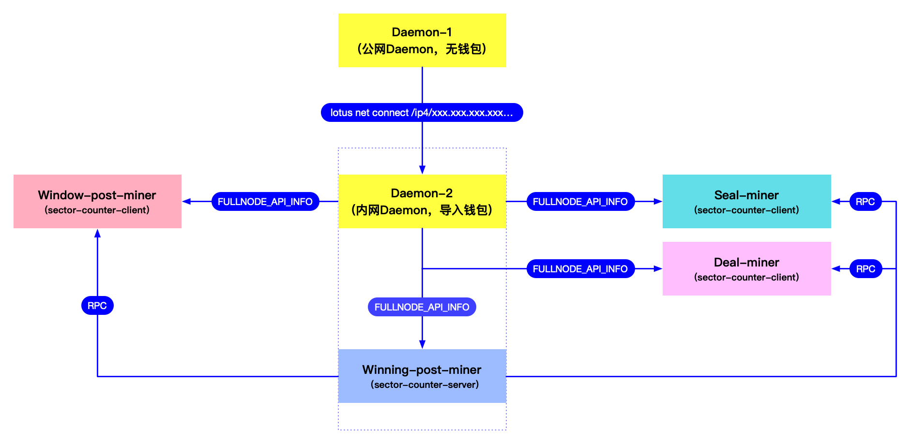

# 问题整理

下面有一些问题是

**1.daemon的部署** - max

Q: 我们原来是2台daemon机器互备,单miner挂一个节点
现在是否只需要一个有转发到公网的daemon,剩下的一个机器可以用做seal miner上

A: 是，配置一个转发到公网的Daemon，参考[Daemon公网IP配置](https://github.com/filguard/lotus-ops/blob/jiubei/documents/daemon-operation.md#4-%E7%BB%99deamon%E9%85%8D%E7%BD%AE%E5%85%AC%E7%BD%91ip)。配置Daemon的公网IP有个问题，如果你集群内的机器连外网，是通过一台机器做的代理，而Daemon机器又没有配公网IP的话，只能通过端口映射来实现，端口映射是单向的，会导致其他机器上启动的Daemon无法连上这个做了外网端口映射的Daemon。所以最好是给这个Daemon机器配个公网IP，里面不要导入钱包，只作为内网节点同步连接来用。

然后在post-miner上同时启动一个Daemon，seal-miner、post-miner通过内网连这个Daemon即可，剩下的一台Daemon机器，就可以作为Seal-miner。

**2.分布式miner的部署** - max

Q: 我看到是需要起 winning,wdpost,seal 3个miner.其中一个miner开 sectorId获取即可
我们原来是2台miner机器互备,一台miner多插了点SSD临时当worker
现在是否 一台作为 winning miner
另外一台作为 wdpost miner
然后把 seal miner 放到上述的一个 daemon机器上即可
其中sectorId获取也可以放到 seal miner 上
如果需要 deal miner 如何部署,能否给一些建议

A: 可以用现在的2台，一台作为winning-post-miner, 一台作为window-post-miner，seal-miner按第1条说的，放到一台Daemon上即可，sectorId获取，部署到winning-post-miner（负载最低）。
deal-miner最好是单独用一台机器来接单，订单少的话，也可以用seal-miner替代。
deal-miner和seal-miner本质上没什么区别，只是deal-miner配了multi address。

3.worker的部署.我们需要 AP-PC1绑定.但是 PC1-PC2就无法绑定了.全部需要内网传输到 gpu机器 - xy

这里每个 worker 机器原来是并行 30个 lotus-worker进程,每个worker单独只做一个sector的p1,开了 SDR , SDR_PRODUCERS设置为1
但是我看了文档中说的 FIL_PROOFS_USE_MULTICORE_SDR、FIL_PROOFS_MULTICORE_SDR_PRODUCERS、ENV_CPU_CORE_BEGIN_NUM、ENV_CPU_CORE_END_NUM环境变量
其中 后两个是软件新增的是把.而且也建议 7302 把 FIL_PROOFS_MULTICORE_SDR_PRODUCERS 设为 2 ,是这样嘛
那我现在应该怎么部署,希望是用满2T内存的并发,开SDR
a.是起一个 lotus-worker 还是依然30个 lotus-worker 并行
b.SDR 和上述的4个环境变量如何设置
c.我们原来worker也放了 proof和proof cache 证明参数的文件,看文档是否只有 daemon miner c2 需要.这个没有尝试过.

- p1p2机器建议跟你们现在的跑法一致即可，明天可以详细沟通。

4.gpu机器的部署.原来是8卡机起了8个 lotus-worker 通过 CUDA_visible 配置绑定gpu - mje

现在是否可以,并且是否需要单卡并行 环境变量NUM_HANDLES、NUM_KERNELS 如何设置

- worker还需要按照之前的方式启动就可以，c2worker启动前需要增加两个环境变量：`NUM_HANDLES=10`、`NUM_KERNELS=2`
单卡并行可以已经实现，但是不建议这样做，因为目前优化显存占用已经很高。

5.worker和gpu不通过 seal miner 直接落盘到 nfs存储如何实现 - mje

- 只能通过启动多个seal miner来间接实现，但是该方法有个弊端，就是seal miner拆分多个会导致Sector ID并不是连续的，也就是说后续再进行合并就会出现Sector ID不全的情况，建议不要这样操作。 

6.scheduler的配置中 AutoPledgeDiff 是什么意义 - xy

自动化添加封装 lotus-miner sectors mypledge 的使用方式,该命令的后果是如何

- AutoPledgeDiff 为 0 和 1 分别是两种 pledge 派发方式。
① 默认值是 0，用于用户自己在自动化任务中批量派发 pledge 任务，例如 60分钟，一次性派发 20 个 pledge，这个模式目前使用较多；
② 如果设置为 1，则表示平滑派发 pledge 任务，例如每3分钟派发一个 pledge。
- 另外，
① lotus-miner sectors pledge  官方标准命令，一次性派一个 pledge；
② lotus-miner sectors mypledgeonce 自定义命令，为每一个有 AP 工作能力的算力机器分配一个 AP。如果 10 台设备都有 AP 工作能力时（各个AddPieceMax可能不相同），但如果发送 10 个 pledge 任务，系统会自动为每个 lotus-worker 平铺调度一个；
③ lotus-miner sectors mypledge 自定义命令，为每一个有 AP 工作能力的算力机器分配它所有的  "AddPieceMax": X 这个数量的全部总和 AP。

7.显卡驱动和cuda是否需要变更 - mje

- 不需要

8.如果在部署新程序中遇到问题，已经部署了一半发现无法继续，是否可以快速还原到官方版本 - max + xy

分布式miner和调度，都可以快速切换回官方版本，但是要注意一点：
针对已经跑了一些算力的情况，需要在winning-post-miner上，用原来miner的owner，重新初始化一个不带任何元数据的空miner，然后复制到window-post-miner上，所有封装过程中的扇区元数据，都保存在seal-miner和deal-miner上。

**9.分布式miner和daemon之间如何连接？**

分布式miner和daemon之间的连接架构如下图（可在新窗口查看大图）：

- **Daemon-1**：给Daemon-1配公网IP主要是为了提升节点的稳定性，只要节点健康稳定，爆块才会稳定。但是如果直接把导入了钱包的Daemon暴露在公网中也是非常不安全的，毕竟Lotus的钱包管理还是非常原始的。Daemon-1的作用就是连接更多外部的节点。然后让Daemon-2也连接到Daemon-1，因为是内网，所以连接非常快，Daemon-1可以理解为内网的miner和区块链通信的一个桥梁。

  但是这里有个问题，就是我用端口映射的方式，给Daemon-1配公网IP以后，发现在Daemon-2上，无法通过 `lotus net connect /ip4/xxx.xxx.xxx.xx/... `连上Daemon-1，因为NAT映射是单向的。如果Daemon-1是直接配公网IP的，那就没有问题。

- **Daemon-2**：内网的miner全部连接daemon2，同时这个daemon也启动在winning-post-miner上，保证出块的miner连接是最快的，考虑冗余的话，可以在window-post-miner上再同步一个轻节点daemon作为备份，关于轻节点daemon，请[参照快照导出导入和快照剪裁](https://github.com/filguard/lotus-ops/blob/master/documents/daemon-operation.md#3-%E5%AF%BC%E5%85%A5%E5%AF%BC%E5%87%BA%E5%90%8C%E6%AD%A5%E6%95%B0%E6%8D%AE%E8%A3%81%E5%89%AA%E5%BF%AB%E7%85%A7)。

- **Winning-post-miner**：只负责爆块，因为这台机器负载比较低，所以在上面同时启动Daemon-2。另外，Winning-post-miner也是sector-counter的服务端，负责统一分配扇区ID，其他miner（主要是seal-miner和deal-miner）都从这台机器上申请扇区ID。

- **Window-post-miner**：只负责时空证明，上面可以同时同步一个备份的Daemon。

- **Seal-miner**：负责分配任务，管理所有的seal-worker，连接Daemon-2。

- **Deal-miner**：负责接单，连接Daemon-2，需要配置multiaddr，需要连接几台seal-worker，和上面seal-miner连接的worker不同，相当于是把所有的seal-worker分成了2组，seal-miner连接一批，deal-miner连接一批，具体架参考[分布式Miner架构](https://github.com/filguard/lotus-ops/blob/master/documents/distributed-miner-configuration.md#%E5%8A%9F%E8%83%BD%E8%AF%B4%E6%98%8E)。

- **关于多个seal-miner，或者seal-miner + deal-miner的说明**
  这里建议订单少的话，就不需要deal-miner了，直接用seal-miner替代deal-miner即可。

  因为如果配置了多个seal-miner，或者seal-miner + deal-miner以后，如果想回退到单miner，就会有个副作用：seal-miner只会包含自己的封装的扇区数据，无法同步deal-miner或其他seal-miner上的扇区数据，这样通过`lotus-miner sectors list`查看的扇区列表，就是不完整的，`lotus-miner info`的扇区统计数据也是不完整的，只是显示不完整，但是不会影响时空证明和爆块。
  如果以后有回退到单miner的需求，或者比较介意这个问题，那就只能配一个seal-miner。按照我们的设计，集群越来越大以后，是不会再有回退到单miner的需求的，所以没有解决多个seal-miner之间扇区数据一致性的问题（分布式架构里面，也没这个必要）。

**10.分布式miner如何切换回单miner？**

按第8条的方法，初始化一个不含任何元数据(扇区数据)的winning-post-miner和window-post-miner，专门用来做时空证明和爆块。切换回单miner的时候，只需要停掉winning-post-miner和window-post-miner，然后在seal-miner上开启window-post和winning-post功能即可，也就是以seal-miner作为回退后的单miner（因为seal-miner上的数据是完整的，包含所有扇区数据，winning-post-miner和window-post-miner上没有扇区数据）。

**11.分布式miner架构，miner之间如何交互？**

miner之间的交互就是从同一个地方获取扇区id的问题，通过rpc交互，其他不需要交互，各司其职即可。所有的seal-worker只连seal-miner。post-miner不需要有worker，只能连接daemon查看链上的信息，如`lotus-miner proving deadlines`、`lotus-miner info`，但是无法看到扇区列表（post-miner本地元数据不含扇区数据）。日常的操作都在seal-miner上进行即可，post-miner几乎不用管。