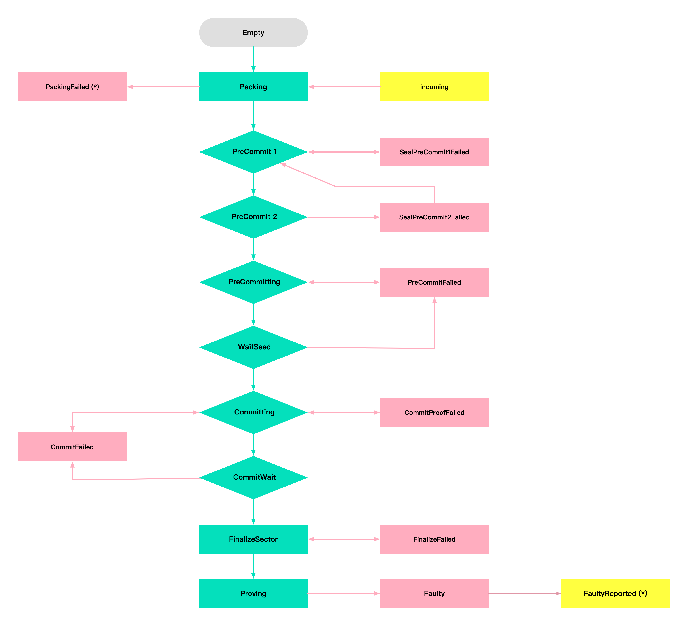

# 扇区生命周期及状态管理

扇区是Filecoin网络中的数据存储单元，目前主网的扇区大小有32GiB和64GiB。

## 1. 扇区生命周期详解
Filecoin网络的扇区，需要通过一系列的计算过程，最终得到扇区内数据的证明结果，并存储到区块链上。

扇区的主要计算过程包括：PreCommit1(PC1)、PreCommit2(PC2)、Commit2(C2)三个过程，目前在AMD EPYC 7542 CPU 和 2080Ti显卡上，基于官方代码，计算PC1的过程大约需要3个小时，PC2需要25分钟，C2需要40分钟。基于社区及优化后的代码，PC2为10分钟左右，C2在15分钟左右。

### 1.1 随机数扇区生命周期
随机数扇区即通过`lotus-miner sectors pledge`生成的扇区，扇区中存储的都是没有实际价值的随机数，目前仅仅是为了承诺有效算力。可以通过操作，将随机数扇区声明为有效数据存储的扇区。

### 1.2 订单扇区生命周期
订单扇区是矿工通过Filecoin的订单撮合市场，存储了客户的真实数据以后生成的扇区。

## 2. 扇区状态管理
扇区主要状态包括：PreCommit1、PreCommit2、Committing、FinalizeSector，状态变化如下图所示：


### 2.1 更新扇区状态
```sh
$ lotus-miner sectors update-state --really-do-it <sectorId> <newState>
```
针对`CommitFailed`状态的扇区，可通过以下命令，将扇区状态更改为`Committing`状态。
```sh
$ lotus-miner sectors update-state --really-do-it <sectorId> Committing
```

### 2.2 删除扇区
```sh
$ lotus-miner sectors remove --really-do-it <sectorId>
```
针对`PreCommitFailed`和`SealPreCommit1Failed`状态的扇区，因为还没有质押，可通过上面的命令直接删除。
