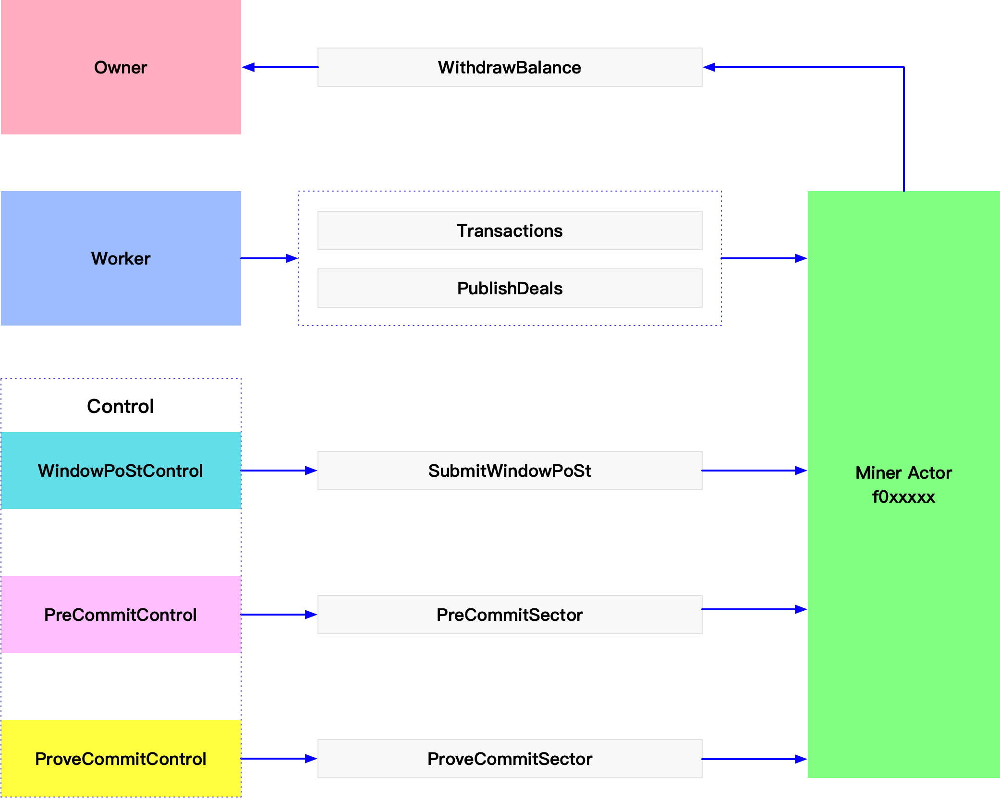

# Lotus钱包管理及使用场景

## 1. Lotus钱包常用操作
列出钱包地址:
```sh
$ lotus wallet list
```

查看余额:
```sh
$ lotus wallet balance <WALLET_ADDRESS>
```

默认钱包地址:
```sh
$ lotus wallet default
```

设置默认钱包地址:
```sh
$ lotus wallet set-default <WALLET_ADDRESS>
# 例如: lotus wallet set-default fxxxx001
```

从默认钱包地址发送代币:
```sh
$ lotus send <TARGET_ADDRESS> <AMOUNT>
# 例如: lotus send fxxxxx001 10
```

从指定钱包地址发送代币:
```sh
$ lotus send --from=<SENDER_ADDRESS> <TARGET_ADDRESS> <AMOUNT>
# 例如: lotus send --from=fxxxxxx002 fxxxxxx001 3
```

导出钱包和私钥:
```sh
$ lotus wallet export <WALLET_ADDRESS>
# 例如: lotus wallet export fxxxxx001 > fxxxxx001.privatekey
```

通过私钥导入钱包:
```sh
$ lotus wallet import 
# 根据提示输入私钥，导入钱包
# 例如: lotus wallet import fxxxxx001.privatekey
```

## 2. 为Miner配置多个钱包
一个Miner可以配置：Owner地址、Worker地址、Control地址。



Miner初始化的时候，会创建一个`f0`开头的Actor地址并发送到链上，所有发送到Miner的转账消息，都会发送到Actor账户中。
可以为Miner配置以下几个不同类型的钱包，分别负责提现、时空证明、PreCommitSector、ProveCommitSector。

#### 2.1 Owner钱包
Miner初始化的时候，会绑定一个Owner钱包，Owner钱包主要用于：
- 更换Miner的Owner或Worker钱包；
- Miner Actor提现后的币将进入Owner钱包；
- 当WindowPoSt钱包账户余额不足时，用于提交时空证明；

Owner钱包强烈建议更换为冷钱包或硬件钱包，可通过以下命令更换Owner地址。
```sh
$ lotus-miner actor set-owner --really-do-it <WALLET_ADDRESS>
```
更换后的新Owner钱包地址，也需要导入到Miner连接的Daemon节点中。

#### 2.2 Worker钱包
Worker钱包用于发送和支付矿工执行的日常操作，包括：
- 初始化Miner；
- 更换Miner的`peer id`或`multiaddresses`；
- 与订单市场或支付通道的actor交互；
- 签名新的区块；
- 提交证明消息、上报失败扇区消息；
- 在下列情况下，用来提交时空证明的消息：
  - 没有配置时空证明的Control地址，或时空证明的Control地址余额不足；
  - Owner钱包地址余额不足。

Worker钱包必须保持有充足的币，否则将会影响封装、时空证明等。

#### 2.3 Control钱包
Control钱包用来提交时空证明，以及提交PreCommit和ProveCommit消息。

**(1) 创建Control钱包**
```sh
lotus wallet new bls
> f3defg...

lotus send --from <address> f3defg... 100
```
**(2) 配置Control钱包**
```sh
lotus-miner actor control set --really-do-it f3defg...

> Add f3defg...
> Message CID: bafy2...
```

**(3) 等待消息上链**
```sh
lotus state wait-msg bafy2...

> ...
> Exit Code: 0
> ...
```

**(4) 查看Control列表**
```sh
lotus-miner actor control list

> name       ID      key        use    balance
> owner      t01111  f3abcd...  other  300 FIL
> worker     t01111  f3abcd...  other  300 FIL
> control-0  t02222  f3defg...  post   100 FIL
```

## 3. 为PreCommit和ProveCommit配置Control钱包
**(1) 创建Control钱包**

通过以下命令，创建2个f3类型的钱包地址，并给钱包转币。
```sh
lotus wallet new bls

> f3rht...

lotus wallet new bls

> f3sxs...

lotus wallet list

> Address   Balance  Nonce  Default
> f3rht...  0 FIL    0      X
> f3sxs...  0 FIL    0
```
**(2) 获取钱包ID**
```sh
lotus wallet list -i

 > Address   ID        Balance                   Nonce  Default
 > f3rht...  f0100933  0.59466768102284489 FIL   1      X
 > f3sxs...  f0100939  0.4 FIL                   0
```
**(3) 添加Control地址**
```sh
lotus-miner actor control set --really-do-it=true f0100933 f0100939

 > Add f3rht...
 > Add f3sxs...
 > Message CID: bafy2bzacecfryzmwe5ghsazmfzporuybm32yw5q6q75neyopifps3c3gll6aq

lotus actor control list

 > name       ID      key        use    balance
 > owner      t01...  f3abcd...  other  15 FIL
 > worker     t01...  f3abcd...  other  10 FIL
 > control-0  t02...  f3defg...  post   100 FIL
 > control-1  t02...  f3defg...  post   100 FIL
```
**(4) 配置Control地址**
修改Miner的配置文件`$LOTUS_MINER_PATH/config.toml`，更新`[Addresses]`中的`PreCommitControl`和`CommitControl`地址。
```toml
[Addresses]
PreCommitControl = ["f3rht..."]
CommitControl = ["f3sxs..."]
```
